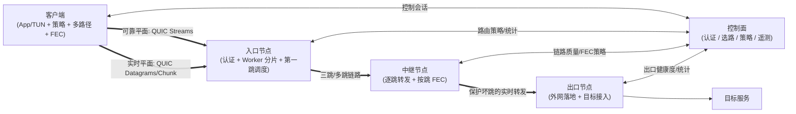
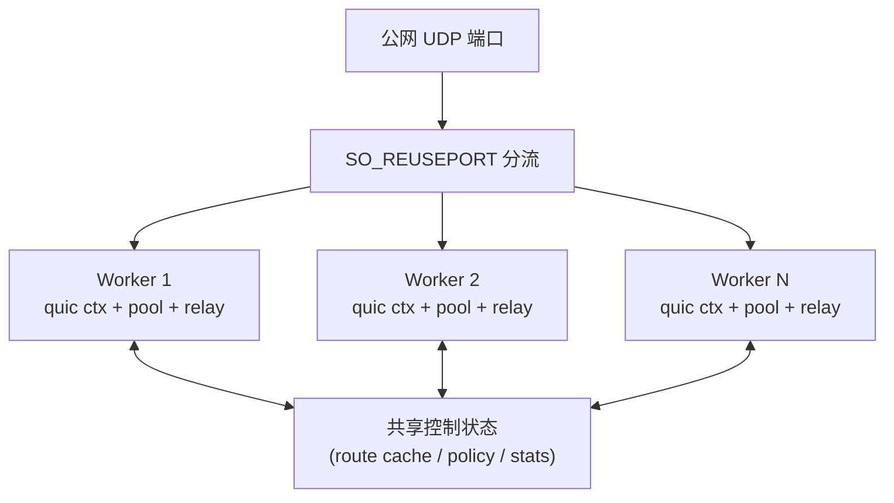

# NB 第二代架构草案

> [01-需求](01-requirements.md) | [02-架构](02-architecture.md) | [03-已实现](03-implementation.md) | [04-部署运维](04-deployment-ops.md) | [05-路线图](05-roadmap.md) | 06-第二代架构草案(本篇) | [07-手机代理客户端方案](07-手机代理客户端方案.md)

## 1. 设计目标

NB v1 的核心价值是把 `picoquic` 稳定接入，并完成三跳 source-route、多连接池、优先级、链路质量观测和直播双发试验。

**阶段说明**：本篇描述的是 **V2 终局方向**，不是当前直接开工范围。  
当前阶段先按 [08-V1.5实施方案](08-V1.5实施方案.md) 落地：继续保留 `TCP-over-QUIC`，优先演进服务端、中继和控制面。  
本篇中涉及的“手机客户端、自研实时平面、客户端 multipath、FEC 下沉”均属于 V2。

NB v2 的目标不再是“把所有业务都先转成 TCP，再塞进 QUIC stream”，而是升级为一套**控制面驱动的双平面多跳传输系统**：

- **可靠平面**：承载认证、控制、网页、API、普通代理流，继续基于 QUIC stream。
- **实时平面**：承载直播媒体、实时状态、拍卖互动数据，基于 QUIC datagram + chunk + FEC。
- **控制面**：统一处理认证、选路、QoS、FEC 策略、出口选择和遥测。
- **多路径层**：只在真正有收益的链路段启用 multipath，不做全局默认。

## 2. 总体架构

## 3. 核心设计原则

1. `picoquic` 继续只负责 QUIC 传输内核：拥塞控制、pacing、ACK/loss、加密、path quality、multipath/datagram。
2. NB 自己负责业务和产品语义：认证、选路、优先级、QoS、FEC 策略、客户端分类。
3. 不再把 FEC 叠在“可靠 stream 字节流”上，而是下沉到实时平面。
4. 中继继续保持“路径无状态、按 route token 转发”的产品特性。
5. 服务端扩容采用“多 worker + 每 worker 独立 quic context + SO_REUSEPORT”，不共享一个 `picoquic_quic_t`。

## 4. 数据平面拆分

### 4.1 可靠平面

适用业务：

- 认证与控制消息
- API 请求
- 普通网页和下载
- 传统 TCP 代理流
- 任何“不允许丢”的业务

实现方式：

- 使用 QUIC bidi stream
- 继续保留 source-route 思路
- 服务端改用 `prepare_to_send` 发送模型，减少 `add_to_stream` 额外排队复制
- 保留流优先级，但不再依赖它解决直播问题

### 4.2 实时平面

适用业务：

- 直播媒体
- 拍卖互动状态
- RTC 风格的实时小包
- 可容忍少量丢失、但不能容忍大重传抖动的数据

实现方式：

- 使用 QUIC datagram
- 每个 datagram 携带媒体块或实时块，不再伪装为完整 TCP 字节流
- 应用层自己定义 `chunk` 协议头
- 用 FEC 和 deadline 驱动恢复和丢弃

## 5. 节点职责

### 5.1 客户端

> 本节属于 **V2 范围**，不纳入当前 V1.5 开发。

客户端不再只是 SOCKS/TUN 的哑入口，而是第一个业务决策点：

- 建立控制会话与数据会话
- 执行认证
- 识别流类别：可靠、实时、批量
- 生成 route 和策略元数据
- 对实时平面做 chunk 化
- 对实时平面做 FEC 编码
- 如有 `Wi-Fi + 蜂窝`，执行第一段 multipath

### 5.2 入口节点

入口节点从“第一跳代理”升级为“边缘接入网关”：

- 终结认证和控制会话
- 接收客户端流标签
- 把用户或会话分配给某个 worker
- 执行第一跳选路
- 将可靠平面送入 stream relay
- 将实时平面送入 datagram relay

其中：

- **可靠平面相关能力**可拆到 V1.5 先做
- **实时平面 datagram relay** 保留到 V2

### 5.3 中继节点

中继节点保持轻量，但增加按跳媒体保护能力：

- 按 route token 动态转下一跳
- 维护到下一 hop 的连接组
- 只对实时平面执行 hop-local FEC
- 继续上报本跳 RTT/loss/jitter
- 不承担用户认证和最终目标 connect

其中：

- `逐跳转发 + 连接组 + 链路质量上报` 属于 V1.5
- `实时平面 hop-local FEC` 属于 V2 的完整形态

### 5.4 出口节点

出口节点负责真正的目标落地：

- 可靠平面：DNS、TCP connect、stream gateway
- 实时平面：对接目标媒体协议或自研边缘协议
- 维持出口白名单、出口质量统计
- 向控制面回报出口健康度

其中：

- `DNS/TCP connect/stream gateway` 属于 V1.5
- `实时媒体协议落地` 属于 V2

## 6. 控制面

控制面是 v2 必需组件，职责包括：

- 用户认证鉴权
- 会话票据与恢复
- 线路探测与 route 下发
- 出口调度
- QoS 与套餐限速
- FEC 策略
- multipath 策略
- 全局遥测汇聚

控制面至少要下发这几类对象：

- `路由配置`：主路径、备路径、跳数限制、出口区域
- `流量策略`：哪些域名/协议/流标签归入实时平面
- `FEC 策略`：哪些 hop 启用，编码比例，回滞阈值
- `多路径策略`：客户端段是否开启多路径，是否允许实时流独占 path
- `QoS 策略`：用户上限、实时流优先级、突发额度

## 7. FEC 层设计

### 7.1 放置位置

FEC 只放在**实时平面**，不再覆盖全量可靠流。

原因：

- 可靠流本来依靠 QUIC 重传与排序保证完整性
- 在可靠 stream 上再做双发，会叠加 2 倍带宽与 2 倍复制开销
- 直播更在意 deadline 和毛刺，而不是绝对零丢失

### 7.2 生效位置

推荐优先保护这些链路段：

1. `middle -> exit`：当前最典型的坏跳
2. `client -> entry`：当客户端具备多路径能力时
3. `entry -> middle`：只有在这段明显恶化时才启用

### 7.3 编码语义

按 `group` 编码：

- 每组 `k` 个 source chunk
- 额外生成 `r` 个 repair chunk
- `group_id` 唯一标识一组恢复单元
- 超过 `deadline` 的组直接丢弃，不继续恢复

### 7.4 与控制面的关系

- 控制面决定是否开启、初始比例和阈值
- 数据面按实时链路质量局部微调 repair 比例
- 使用回滞，避免在边缘场景下频繁开关

## 8. 多路径层设计

### 8.1 最优先的启用位置

**客户端 -> 入口节点**

这是最值得做的链路段，因为：

- 手机天然可能具备 `Wi-Fi + 蜂窝`
- 这是最容易拿到“真实独立路径”的位置
- 对直播首要价值是降低毛刺、增加连续性

### 8.2 次优先位置

**中继 -> 出口**

只有在机器具备真实双 uplink / 双运营商 / 双公网出口时才值得启用。  
如果只是单网卡单出口，逻辑 multipath 的收益会很有限。

### 8.3 使用方式

多路径层不替代连接池，而是作为连接内 path 调度增强：

- 可靠流：可固定到稳定 path
- 实时流：可固定到低 jitter path
- 实时 chunk：必要时可在两个 path 上做 path 级冗余

## 9. 连接池与多路径的关系

两者不是替代关系：

- **连接池**解决“选哪条线路、哪个出口、哪个 lane”
- **多路径**解决“同一条连接里的多个 path 怎么发”

推荐组合：

- 外层：多连接池 + 控制面选路
- 内层：multipath/path affinity/datagram path-ready

## 10. 服务端并行模型

### 10.1 扩容方式

每个节点使用多 worker：

- 每个 worker 独立一个 `picoquic_quic_t`
- 每个 worker 独立连接池、流表、datagram 表和 FEC 缓冲
- 使用 `SO_REUSEPORT` 接管同一 UDP 端口

### 10.2 共享状态

只共享低频或只读状态：

- 白名单
- 路由策略
- 用户认证缓存
- 出口健康表

不共享高频传输状态：

- `picoquic_quic_t`
- stream/datagram 会话表
- FEC 临时恢复缓冲
- 每连接的 path quality 状态

## 11. 从 v1 到 v2 的演进步骤

### 11.1 第一阶段：v1.5（当前主线）

- 服务端把 QUIC 发送模型从 `add_to_stream` 迁到 `prepare_to_send`
- 保持当前 stream 主体结构不变
- 服务端引入多 worker 架构
- 保留当前 `TCP-over-QUIC` 产品形态
- 不引入手机客户端和 datagram 实时平面

### 11.2 第二阶段：v1.8 / v2 过渡层

- 增加客户端元数据能力
- 入口节点支持区分实时与可靠流
- 控制面开始下发 route、QoS 和实时策略

### 11.3 第三阶段：v2.0-alpha

- 引入实时 datagram 平面
- 定义最小 chunk 头
- 在 `middle -> exit` 落地 hop-local FEC

### 11.4 第四阶段：v2.1

- 客户端到入口支持 multipath
- 控制面支持路径质量驱动的策略切换

### 11.5 第五阶段：v2.5

- 认证、套餐、QoS、选路、出口编排产品化
- 客户端逐步替代 Shadowrocket

## 12. 对当前实现的保留与替换

### 12.1 保留

- `entry / middle / exit` 三角色
- source-route 路径无状态思想
- 连接池设计
- path quality 观测
- 运维与日志骨架

### 12.2 替换

- “所有业务都走 TCP-over-QUIC”
- “FEC = 可靠 stream 双发 + 去重”
- “单 reactor 作为长期终局”
- “SOCKS5 作为长期客户端接口”

## 13. 一句话总结

NB v2 应该演进为：

**控制面驱动的双平面多跳 QUIC 传输系统**

- 可靠平面：`QUIC Streams`
- 实时平面：`QUIC Datagrams + Chunk + FEC`
- 扩容方式：`多 worker + SO_REUSEPORT`
- 路径策略：`外层连接池选线路，内层 multipath 选 path`
- FEC 位置：`实时平面`，而不是可靠 stream 之上
