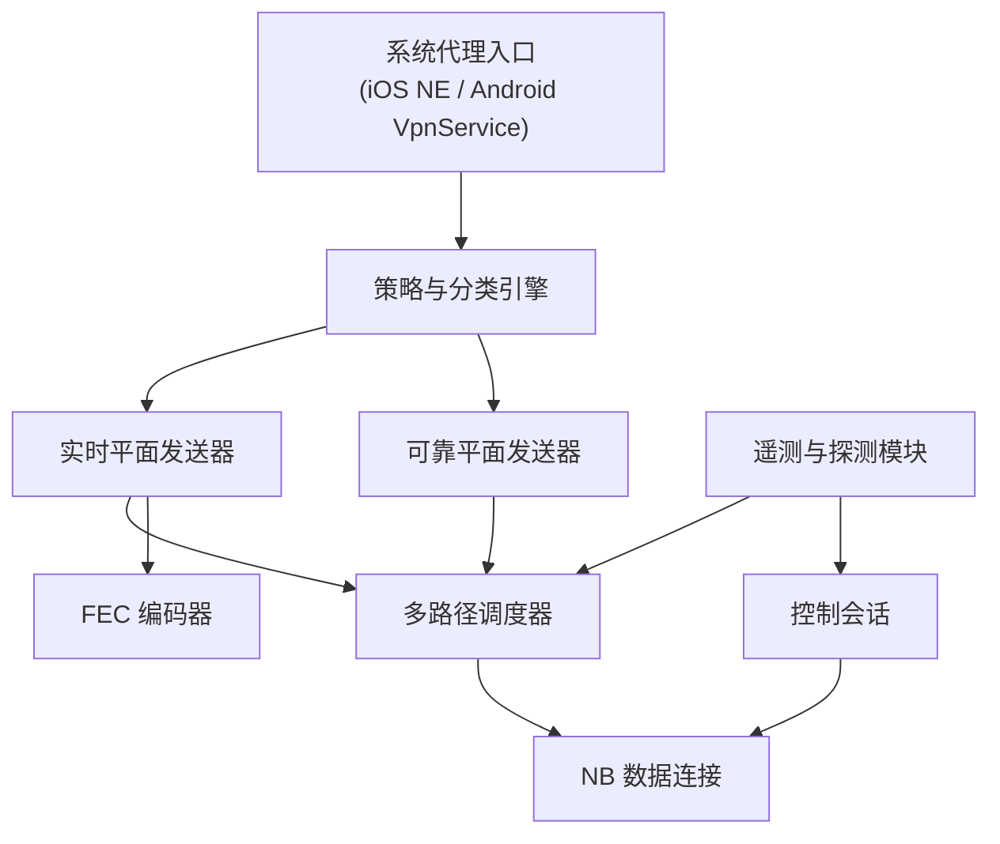

# NB 手机代理客户端方案

> [01-需求](01-requirements.md) | [02-架构](02-architecture.md) | [03-已实现](03-implementation.md) | [04-部署运维](04-deployment-ops.md) | [05-路线图](05-roadmap.md) | [06-第二代架构草案](06-第二代架构草案.md) | 07-手机代理客户端方案(本篇)

## 1. 目标定位

> 本文档属于 **V2 范围**。  
> 按当前阶段划分，V1.5 暂不实现手机客户端，继续保留现有 `TCP-over-QUIC` 接入方式。  
> 本文档保留为 V2 设计输入，不纳入当前直接开发范围。

基于 NB v2，手机客户端不再只是 SOCKS5 前端，而是 NB 数据面的**第一层调度节点**。

客户端要同时完成：

- 用户认证
- 会话恢复
- 业务分类
- 可靠流转发
- 实时流 chunk 化
- FEC 编码
- 客户端侧多路径调度
- 遥测上报

最终目标不是“做一个能连上的代理 App”，而是做一个**可产品化、可控制、可观测、可扩展**的手机边缘节点。

## 2. 支持的平台形态

### 2.1 iOS

推荐基于 `Network Extension` 做两种模式：

- `Packet Tunnel Provider`
  - 适合全局代理、按规则分流
  - 能拿到 IP 层流量，便于业务分类和未来替代 Shadowrocket
- `App Proxy Provider`
  - 适合应用级代理
  - 上线门槛相对低，但流量可见度不如 Packet Tunnel

长期建议：**以 Packet Tunnel 为主**。

### 2.2 Android

推荐基于 `VpnService`：

- 建立 TUN 设备
- 截获出站 IP 包
- 在用户态做分流、分类和转发

长期建议：Android 也统一走 TUN 模式，便于和 iOS 端共享更高层的数据面设计。

## 3. 客户端总架构

## 4. 客户端内部模块

### 4.1 系统代理入口

职责：

- 接管手机出站流量
- 获取五元组、目标域名、首包时间等基础信息
- 将流量送入 NB 客户端内核

实现建议：

- iOS 使用 Packet Tunnel 的 TUN 读写
- Android 使用 VpnService 的 TUN 文件描述符
- 初期支持全局模式，后续再加规则分流

### 4.2 策略与分类引擎

职责：

- 判断流量是否走 NB
- 判断是可靠平面还是实时平面
- 给每个流打业务标签

分类输入：

- 域名特征
- SNI / ECH 前的可见字段
- 目标 IP 段
- 端口
- App UID / Bundle ID
- 历史行为特征

输出建议：

- `可靠流`
- `实时流`
- `批量流`
- `绕行直连`

### 4.3 控制会话

职责：

- 完成用户认证
- 获取路由和策略
- 获取 FEC 与多路径配置
- 上报客户端链路质量

控制会话建议始终走**可靠平面**，并保持长连接。

### 4.4 可靠平面发送器

职责：

- 承载认证、控制、网页、普通 TCP 代理
- 把需要完整可靠交付的流映射到 QUIC stream

实现方式：

- 客户端对每条逻辑流分配 `stream_id`
- 通过 route token 指定第一跳和目标策略
- 服务端继续用 source-route relay

### 4.5 实时平面发送器

职责：

- 承载直播媒体、拍卖状态、实时控制
- 将实时数据切为 `chunk`
- 使用 QUIC datagram 发送

每个 chunk 至少包含：

- `session_id`
- `flow_id`
- `chunk_id`
- `group_id`
- `seq_in_group`
- `发送时间`
- `deadline`
- `是否为 repair`
- `FEC 配置编号`

### 4.6 FEC 编码器

职责：

- 只对实时平面生效
- 对 chunk group 生成 repair chunk

建议设计：

- 小步快跑版本先做固定比例编码
- 后续再接入自适应 repair 比例
- 控制面下发 `k/r` 范围，本地按链路波动微调

### 4.7 多路径调度器

职责：

- 管理 `Wi-Fi + 蜂窝`
- 维护每条 path 的 RTT/loss/jitter/bandwidth
- 决定可靠流和实时流的 path 选择

建议策略：

- 可靠流默认固定主 path，失败时切换
- 实时流优先走低 jitter path
- 必要时实时流可做 path 级冗余

### 4.8 遥测与探测模块

职责：

- 向控制面上报本地可用网络质量
- 对入口节点做周期探测
- 辅助本地调度和远端 route 决策

## 5. 客户端会话模型

客户端至少维护三类会话：

### 5.1 控制会话

- 永久在线
- 小流量
- 可靠
- 包含认证、策略、心跳、统计上报

### 5.2 可靠数据会话

- 用于 QUIC streams
- 适合网页/API/普通流量
- 支持会话恢复和 0-RTT

### 5.3 实时数据会话

- 用于 QUIC datagrams
- 可独立于可靠数据会话，也可共用同一 QUIC 连接但分不同平面
- 更偏向直播与互动

## 6. 代理模式选择

### 6.1 过渡期方案

为了快速替换 Shadowrocket，可先做：

- TUN 接管全局流量
- 在客户端内部把普通 TCP 继续转换为“可靠平面逻辑流”
- 暂不暴露给用户复杂配置

优点：

- 上线快
- 能尽快验证客户端可控后的收益

缺点：

- 仍保留一部分“TCP-over-QUIC”遗产

### 6.2 中期方案

引入双平面：

- 普通流量走可靠平面
- 直播相关流走实时平面
- 客户端开始真正用业务语义分类

### 6.3 长期方案

把客户端做成完整 NB 前端：

- 认证
- 规则分流
- 实时识别
- 多路径
- FEC
- QoS
- 出口和线路策略展示

## 7. 客户端实现步骤

### 7.1 第一步：最小可用版本

目标：

- 替换 Shadowrocket
- 保持现有服务端兼容

实现：

- iOS Packet Tunnel / Android VpnService
- 把所有目标流量先映射到可靠平面
- 支持用户认证和控制会话
- 服务端仍按 v1/v1.5 的 entry/middle/exit 处理

### 7.2 第二步：增加元数据与流分类

目标：

- 让入口节点知道哪些流是直播/实时流

实现：

- 为每条流增加业务标签
- 控制面支持下发分类规则
- 客户端开始区分 `可靠/实时/批量`

### 7.3 第三步：落地实时平面

目标：

- 直播流不再伪装为可靠 TCP 字节流

实现：

- 定义 chunk 协议
- 引入 QUIC datagram 发送器
- 入口和中继支持 datagram relay

### 7.4 第四步：接入 FEC

目标：

- 对实时流在坏 hop 上抗毛刺

实现：

- 客户端对实时 chunk group 编码
- 中继和出口执行按跳恢复
- 控制面动态调整 repair 比例

### 7.5 第五步：接入多路径

目标：

- 利用 `Wi-Fi + 蜂窝` 提升直播连续性

实现：

- 客户端管理两条 path 的质量
- 实时流优先走低 jitter path
- 必要时 path 级冗余

## 8. 客户端与服务端的接口

### 8.1 控制面接口

至少包括：

- 登录认证
- 获取路由
- 获取策略
- 获取 FEC 配置
- 获取多路径配置
- 上报质量统计

### 8.2 数据面接口

可靠平面至少要带：

- 用户或会话标识
- 路由标识
- 业务标签
- 流优先级

实时平面至少要带：

- `flow_id`
- `chunk_id`
- `group_id`
- `deadline`
- `是否 repair`
- `路径偏好`

## 9. QoS 与限速

客户端应配合服务端做两层 QoS：

### 9.1 用户级 QoS

- 服务端控制用户级总速率
- 客户端识别实时流并优先出队

### 9.2 本地调度 QoS

- 实时平面优先于批量流
- 可靠控制流优先于普通网页流
- 低电量或高丢包时可降低批量流活跃度

## 10. 安全与产品化

客户端产品化必须考虑：

- 凭证安全存储
- 设备绑定
- 策略热更新
- 崩溃恢复
- 会话恢复
- 版本灰度
- 可观测日志上传

## 11. 推荐技术路线

### 11.1 第一代手机客户端内核

建议语言：

- iOS：Swift + 部分 C/C++ 内核封装
- Android：Kotlin + NDK C/C++ 内核

建议做法：

- 把数据面核心做成跨平台 C/C++ 库
- iOS/Android 外壳分别接系统代理能力
- 共享控制协议、chunk 协议、FEC 编码逻辑

### 11.2 为什么不建议长期依赖 SOCKS5

因为 SOCKS5 传不了这些关键能力：

- 用户身份
- 业务标签
- path 偏好
- FEC 配置
- 实时平面标识
- 端到端策略同步

所以自研客户端不是“可选增强”，而是 v2 真正成立的前提。

## 12. 一句话落地建议

手机客户端的实现顺序建议是：

1. 先做 TUN 客户端，替换 Shadowrocket
2. 先只跑可靠平面，接入认证和控制面
3. 再补业务分类
4. 再落实时平面 datagram
5. 再补 FEC
6. 最后做 `Wi-Fi + 蜂窝` 多路径

这样能让客户端从“代理前端”逐步升级为“NB 的第一层智能节点”。
